  

 

<picture>
  <source media="(prefers-color-scheme: dark)" srcset="dark.svg">
  <source media="(prefers-color-scheme: light)" srcset="light.svg">
  
</picture>

# 🌐 Socials:

# 👁️ Profile Counter:

# 💻 Tech Stack:

  
  
  
  
  
  

# 🧠 LeetCode Journey:

  

 

  
  

  
  
  
  

  
  
  

---

# 📊 GitHub Stats:

  

 

  

  

---

##  &nbsp; Contribution Activity

---

##  &nbsp; Contribution Snake

  <picture>
    <source media="(prefers-color-scheme: dark)" srcset="https://raw.githubusercontent.com/Himesh-rupchandani/Himesh-rupchandani/output/github-snake-dark.svg">
    <source media="(prefers-color-scheme: light)" srcset="https://raw.githubusercontent.com/Himesh-rupchandani/Himesh-rupchandani/output/github-snake.svg">
    
  </picture>

  

